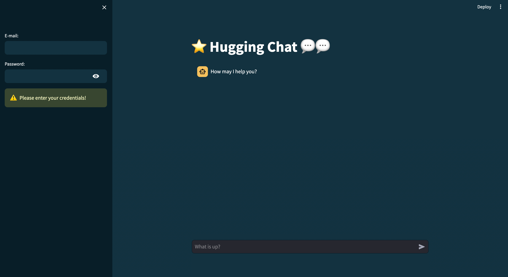

# 📦 Chatbot by using HugChat and Streamlit
```
This project is an exercise in implementing LLM chatbot using HugChat (an unofficial port of HuggingFace Chat API)
```

## Command to run code
``` 
streamlit run streamlit_app.py
```

## Result


## Reference
- [How to build an LLM-powered ChatBot with Streamlit](https://blog.streamlit.io/how-to-build-an-llm-powered-chatbot-with-streamlit/?source=post_page-----6a3c30860fbc--------------------------------)
- [Streamlit App Starter Kit](https://blog.streamlit.io/streamlit-app-starter-kit-how-to-build-apps-faster/)
